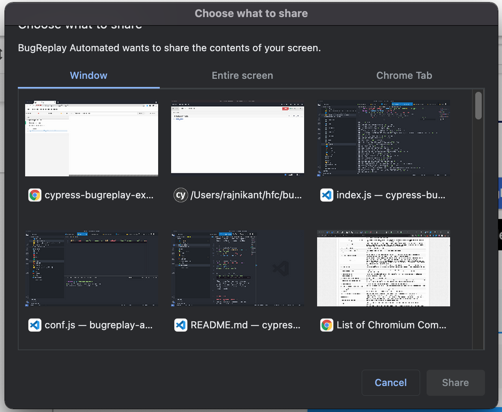

# BugReplay Cypress Plugin
The BugReplay Cypress plugin records screencasts of your automated tests including timesynced JavaScript Console and Network logs

## Installation
Install the package

```sh
npm install cypress-bugreplay --save-dev
```

or if you prefer to use [yarn](https://yarnpkg.com/)

```sh
yarn add cypress-bugreplay --dev
```

## Configuration
### Getting an API key
You will need to sign up for an account at https://bugreplay.com. After that you will need to login and get an API key by clicking the Hamburger Menu, click My Settings, and then Show API Key. You'll use this in the cypress/support/index.js file.


### Adding the BugReplay Integration
After you've initialized your project for Cypress you'll need to edit a few files to configure the plugin:

```js
// cypress/plugins/index.js
const { setupBugReplayPlugin } = require('cypress-bugreplay')
module.exports = (on, config) => {
  setupBugReplayPlugin(on, config)
}

// cypress/support/index.js
import { setupBugReplaySupport } from 'cypress-bugreplay'
setupBugReplaySupport("YOUR_API_KEY_GOES_HERE")
```


After this configuration your tests will automatically be recorded to video, uploaded to BugReplay, and ready for playback alongside the timesynced JS console and network traffic logs.
### Note
You may be presented with a window, to select a screen to capture, during your test run, something like this:


If you see the above screen during your test run, please check the file:
`node_modules/cypress-bugreplay/index.js` and check the option: `launchOptions.args.push('--auto-select-desktop-capture-source=Entire screen');`

Here are few options you can try:
  - In case you have an extended display connected, you can choose   
    "Screen 1" or "Screen 2" depending on where your cypress test runner is running:
    `launchOptions.args.push('--auto-select-desktop-capture-source=Screen 1'); //or Screen 2` 

  - You can also provide the title of the browser window which cypress launches while executing your tests.
  `launchOptions.args.push('--auto-select-desktop-capture-source=cypress-bugreplay-example'); // Its the same as the name of your cypress test project`   


## Running the Test
### Running from Command Line
You can run the test directly by running the following in your terminal:
```sh
npx cypress open
```

### Setting up a script
Inside of `package.json` add the following to the `scripts` object:
```json
"scripts": {
  "cypress:open": "cypress open"
}
```
You can name the script anything you'd like, it does not have to be `cypress:open`.

Then in your command line run:
```sh
npm run cypress:open
```
or
```sh
yarn cypress:open
```


## Limitations
This currently only works for Chrome. We're looking to expand to other browsers in the future.
